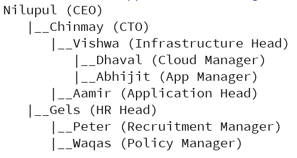
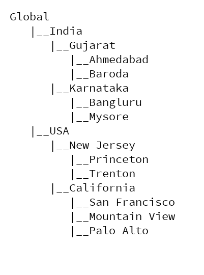
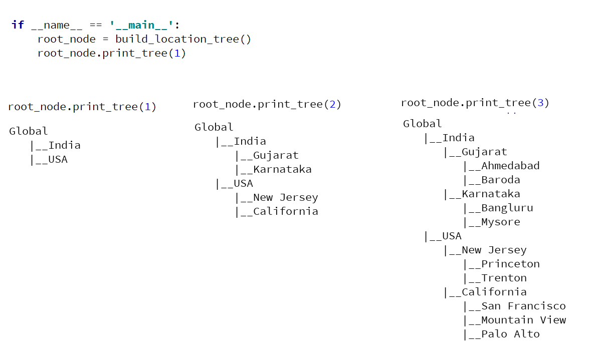

#### Data structures exercise: General Tree

1. Below is the management hierarchy of a company.

    

Extent [tree class](https://github.com/codebasics/data-structures-algorithms-python/blob/master/data_structures/7_Tree/7_tree.py) built in our
main tutorial so that it takes **name** and **designation** in the data part of TreeNode class.
Now extend the print_tree function such that it can print either a name tree, designation tree or name and designation tree. As shown below,

   

Here is what your main function should look like,
```
if __name__ == '__main__':
    root_node = build_management_tree()
    root_node.print_tree("name") # prints only name hierarchy
    root_node.print_tree("designation") # prints only designation hierarchy
    root_node.print_tree("both") # prints both (name and designation) hierarchy
```

2. Build the below location tree using the **TreeNode** class

    

Now modify the print_tree method to take the tree level as input. And that should print the tree only upto that level as shown below,

   
